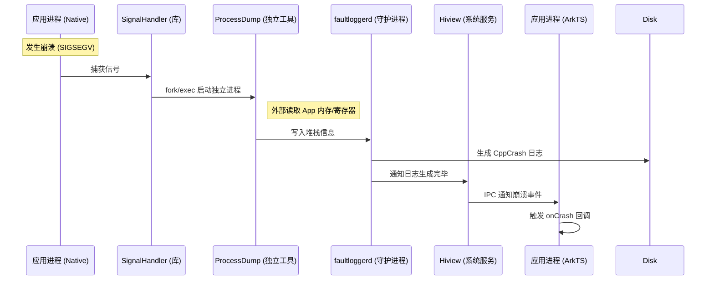
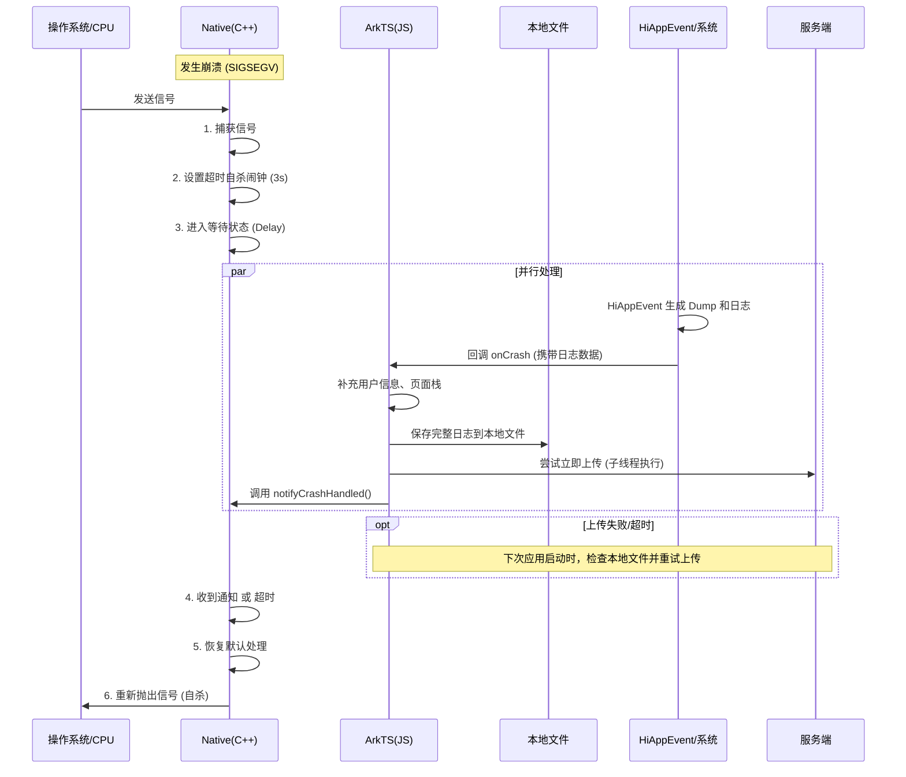

# OpenHarmony APM Native 崩溃监控架构演进总结

本文档总结了在 OpenHarmony 平台上开发 APM SDK 时，关于 Native 崩溃监控方案的演进过程、备选方案对比以及最终架构的选择依据。

## 1. 方案演进与对比

在探索过程中，我们主要讨论了三种技术方案：

### 方案 A：Google Breakpad / Minidump (传统方案)
*   **原理**：
    *   **异常捕获**：在进程内注册信号处理函数（Signal Handler）。
    *   **现场快照**：崩溃发生时，暂停所有线程，读取 CPU 寄存器、线程堆栈、加载的模块列表等内存信息。
    *   **Minidump 生成**：将上述信息写入一种紧凑的二进制格式（Minidump）。
*   **典型实现 (Android 端参考)**：
    1.  **埋雷（初始化）**：
        *   **JNI 入口**: Java 层调用 init，通过 JNI 进入 C++ 层。
        *   **Breakpad 启动**: 初始化 `google_breakpad::ExceptionHandler`，注册信号处理器。
        *   **双线程保活**: 预先创建并挂起两个辅助线程（Filter 线程和 Dump 线程），用于在崩溃后的危险环境中安全回调 Java 代码。
    2.  **踩雷（崩溃瞬间）**：
        *   **信号拦截**: Breakpad 捕获信号，暂停崩溃线程。
        *   **补充 Java 栈**: 唤醒 Filter 辅助线程，通过 JNI 获取当前 Java 堆栈（帮助定位 Native 调用源）。
        *   **生成 Minidump**: Breakpad 将寄存器、内存映射、线程栈等信息写入本地 `.dmp` 文件。
        *   **通知 Java 层**: 唤醒 Dump 辅助线程，通过 JNI 调用 Java 层的 `onNativeCrash`。
        *   **自杀**: 回调结束后，Breakpad 恢复默认信号处理，进程终止。
    3.  **落盘（持久化）**：
        *   **定位与归档**: Java 层收到通知后，找到生成的 `.dmp` 文件，生成包含设备信息的元数据 JSON，并归档到统一目录。
        *   **空间保护**: 检查磁盘空间，不足则尝试内存持有。
    4.  **上报（上传）**：
        *   **独立进程接管**: Java 层收到通知后，立即启动一个配置在 **独立进程 (:crash)** 的 Service。只要 Intent 发出成功（通常只需几毫秒），这个独立的上传进程就能启动并接管日志上传任务，从而实现**即时上报**，而不仅仅是依赖下次启动。
        *   **打包加密**: 将 JSON 和 Dump 文件打包 ZIP 并 AES 加密。
        *   **发送清理**: HTTP POST 上传，成功后删除本地文件。
*   **缺点**：
    *   **太重**：库体积大（编译后约 600KB - 1MB），集成复杂，显著增加包体积。
    *   **解析难**：Minidump 是二进制格式，端侧难以直接读取，必须上传到服务端配合符号表解析。
    *   **无法实时上传**：由于信号处理函数中严禁进行网络 IO 操作（非 Async-Signal-Safe），Breakpad 只能将 Minidump 写入本地磁盘。必须等到**下次应用启动**才能上传，存在显著的感知延迟。


#### 延伸分析：为什么 OpenHarmony 无法复刻 Android 方案？

**核心障碍：Async-Signal-Safe (异步信号安全)**

这是所有 POSIX 系统（Linux/Android/OpenHarmony）通用的铁律。当 SIGSEGV（段错误）发生时，当前线程处于极度不稳定的状态（堆内存可能已损坏，锁可能未释放）。此时只能调用极少数被标记为“异步信号安全”的系统调用（如 `write`, `open`, `fork` 等）。

虽然 Android 方案通过预创建辅助线程或启动独立进程绕过了部分限制，但在 OpenHarmony 上复刻该方案面临三大核心障碍：

| 维度 | Android (Java/JNI) | OpenHarmony (ArkTS/NAPI) | 核心障碍 |
| :--- | :--- | :--- | :--- |
| **1. 线程模型** | **共享内存模型**<br>C++ 线程可通过 JNI 直接操作 Java 对象，虽然危险但技术上可行。 | **Actor 模型 (内存隔离)**<br>Native 线程与 ArkTS 线程内存隔离，无法直接操作对象，必须通过 NAPI 通信。 | **无法直接调用** |
| **2. 通信机制** | **JNI 调用**<br>JNI 接口相对底层，部分操作在崩溃时仍有一线生机。 | **NAPI 调用**<br>NAPI 内部涉及复杂的锁和内存分配。在 Signal Handler 中调用 NAPI 是 **Async-Signal-Unsafe** 的。 | **死锁风险 (Deadlock)** |
| **3. 救生通道** | **独立进程 (Service)**<br>可通过 `android:process` 和 `startService` (Binder) 启动独立进程上传。 | **Ability/Extension**<br>启动新进程需调用 ArkTS API (如 `childProcessManager`)，受限于 NAPI 死锁问题。 | **无法启动新进程** |

**结论**：
*   **Android 方案**：属于 **“内部自救”**。依赖应用自身在崩溃边缘的挣扎（JNI/Binder），风险较高但生态成熟。
*   **OpenHarmony 方案**：必须采用 **“外部救援”**。由于 NAPI 的“生死线”阻隔，应用无法自救，必须依赖系统服务 (`faultloggerd`) 来完成现场保留和日志生成。

### 方案 B：Hybrid Fork (自处理/子进程方案)
*   **原理**：在 Signal Handler 中调用 `fork()` 创建子进程。利用子进程继承父进程内存但拥有独立执行流的特性，在子进程中安全地进行文件写入（JSON 格式）。
*   **特点**：绕过了“信号处理函数中不能分配内存/写文件”的限制，可以立即生成 JSON 日志。
*   **缺点**：
    *   **多线程风险**：在多线程程序中 `fork()` 容易导致死锁（如果崩溃时某个锁被持有，子进程中该锁永远不会释放）。
    *   **实现复杂**：需要精细控制父子进程通信。

### 方案 C：Crash Delayer + HiAppEvent (系统协作/当前方案)
*   **原理**：**“拥抱系统，以退为进”**。
    *   **拥抱系统**：完全依赖 OpenHarmony 系统服务 (`faultloggerd` + `HiAppEvent`) 来生成高质量的堆栈信息。
    *   **以退为进**：Native 层捕获信号后，**不立即自杀**，而是“按住”崩溃线程（Delay），保持进程存活几秒钟。利用这段时间，等待系统完成日志生成并回调 ArkTS，从而实现实时上报。
*   **特点**：极度轻量，充分利用鸿蒙系统能力，打通了 Native 与 ArkTS 的数据壁垒。

---

## 2. 深度解析：为什么选择方案 C？

我们最终坚定选择 **方案 C**，是因为通过深入分析 OpenHarmony 的崩溃处理机制，我们发现它是实现**“实时上报”**的唯一解。

### 2.1 系统级协作机制 (HiAppEvent 原理)
`HiAppEvent` 并非单纯的进程内库，而是依赖于 OpenHarmony 的 DFX 子系统（HiviewDFX）。其核心组件是 **`faultloggerd`** 守护进程。

#### 工作原理图解


#### 详细流程
1.  **信号拦截**：应用启动时，`faultloggerd` 提供的 `SignalHandler` 注册到应用进程。
2.  **外部快照**：崩溃时，`SignalHandler` 启动独立的 **`ProcessDump`** 工具，从外部读取崩溃进程内存生成堆栈。
3.  **IPC 通知**：`faultloggerd` 生成日志后通知 **Hiview**，Hiview 再通过 IPC 将事件分发回应用的 ArkTS 运行时。
4.  **事件回调**：ArkTS 运行时触发 `HiAppEvent.addWatcher` 回调。

### 2.2 竞态条件 (The Race Condition)
这是一个典型的**“死亡竞速”**：
*   **选手 A (崩溃线程)**：Native 线程触发信号 -> 执行默认处理 -> **进程终止**。
*   **选手 B (系统流程)**：守护进程生成日志 -> IPC 通知应用 -> ArkTS 线程执行回调。

**如果没有 Crash Delayer**：
选手 A 瞬间完成动作，进程被操作系统回收。此时选手 B 的 IPC 消息可能刚发出，或者刚到达应用进程，但应用进程已经“死亡”，ArkTS 线程停止调度，回调无法执行。
**结果**：本次崩溃的实时信息丢失，只能等待下次启动时补报。

**引入 Crash Delayer 后**：
我们在选手 A 终点前设置了障碍（`sigsuspend` / `sleep`）。选手 A 被迫暂停。进程保持“僵死但未销毁”的状态。ArkTS 线程（选手 B）得以继续运行，接收 IPC 消息，执行回调，完成上报。
**结果**：成功实现“临终遗言”的实时上报。

---

## 3. 当前架构设计

### 3.1 完整时序图



### 3.2 关键组件职责

1.  **Native 层 (`signal_handler.cpp`)**:
    *   **职责**：只做一件事——**拖延时间**。
    *   **实现**：捕获信号 -> 设置看门狗 -> `wait_for_arkts_and_exit`。

2.  **ArkTS 层 (`AppMonitorService.ets`)**:
    *   **职责**：数据聚合与上报。
    *   **实现**：订阅 `hiAppEvent` -> 写入缓存 -> 解除 Native 等待。

3.  **系统层 (`HiAppEvent` + `faultloggerd`)**:
    *   **职责**：生成高质量的堆栈信息 (Dump)。

---

## 4. 跨线程数据同步挑战

### 问题背景
为了避免 APM 监控逻辑阻塞 UI 主线程，我们将 APM 的核心逻辑（包括 `HiAppEvent` 的监听与处理）放置在独立的 **子线程 (Worker)** 中执行。

### 遇到的问题
在初始化配置时，我们允许业务方传入 `setUserIdFunc` 回调函数。然而，由于 ArkTS 的 **Actor 模型** 实现了线程间的内存隔离：
1.  **无法跨线程调用函数**：主线程传入的 `setUserIdFunc` 无法在子线程中被直接调用。
2.  **上下文丢失**：即使函数能被传递，它所引用的主线程闭包变量在子线程中也是不可访问的。

### 解决方案：从 "Pull" 到 "Push"
为了解决此问题，我们调整了用户 ID 的获取策略，由“崩溃时拉取”改为“变更时推送”：

1.  **废弃回调模式**：不再依赖 `setUserIdFunc` 在崩溃瞬间获取 ID。
2.  **主动推送模式**：
    *   提供 `setUserId(id: string)` 静态接口。
    *   业务层在用户登录或切换账号时，主动调用该接口。
    *   APM SDK 将 User ID **缓存** 在子线程的内存或本地文件中。
3.  **崩溃读取**：当崩溃发生时，子线程直接从本地缓存中读取最新的 User ID，无需与主线程进行任何通信，确保了数据获取的可靠性。

---

## 5. 总结

我们现在的方案是一个**“在这个充满限制的崩溃现场，通过暂停时间，换取上层业务逻辑处理空间”**的巧妙设计。它既保证了系统的稳定性，又最大化了崩溃日志的业务价值。


## 6. AppFreeze 与 Native Crash 的核心差异

### 6.1 完整对比表

| 维度 | Native Crash | AppFreeze |
|------|-------------|-----------|
| **触发源** | 应用进程内部信号<br>（SIGSEGV, SIGABRT等） | 系统外部检测<br>（AppMgrService Watchdog） |
| **检测位置** | 进程内（signal handler） | 系统进程（独立检测） |
| **进程状态** | 信号触发后立即终止 | 初期存活（5秒内）<br>超时后可能被系统杀死 |
| **信号通知** | ✅ 有（SIGSEGV等） | ❌ 无（无信号发送给应用） |
| **可捕获性** | ✅ 可以（signal handler） | ❌ 不可以（无信号可捕获） |
| **主线程状态** | 通常正常运行 | 阻塞（这是问题本身） |
| **回调执行时机** | ✅ 立即（3秒内） | ⚠️ 延迟（下次启动时） |
| **Crash Delayer 作用** | ✅ 关键（延长进程以完成实时上报） | ❌ 无效（回调被系统延迟，无法实时） |
| **实时上报** | ✅ 可以 | ❌ 不可以（延迟到下次启动） |
| **上报时机** | 崩溃瞬间（3秒内） | 下次应用启动时 |
| **解决方案** | Crash Delayer + HiAppEvent | Worker Watchdog + 自实现检测 |

---

### 6.2 通信机制差异

#### Native Crash 的通信流

```
应用进程内：
  SIGSEGV 信号 → signal_handler (进程内同步)
      ↓
  fork 子进程 → 写入日志
      ↓
  setup_delayed_exit() → 阻塞等待
      ↓
  系统生成日志 → HiAppEvent IPC 回调
      ↓
  TaskPool/主线程收到回调 ✅ (进程还活着)
      ↓
  处理完成 → notifyCrashHandled()
      ↓
  Native 线程解除阻塞 → 进程退出
```

#### AppFreeze 的通信流

```
系统侧（进程外）：
  AppMgrService Watchdog → 检测主线程无响应
      ↓
  HiviewDFX 生成事件
      ↓
  系统捕获维测日志（30s内）
      ↓
  日志持久化到系统
      ↓
  ⚠️ 当次启动无法触发回调（日志捕获未完成）
      ↓
  应用重启时通过 onReceive 回调或 holder.takeNext() 获取
```

---

### 6.3 为什么 Native Crash 能收到回调？

**已验证的事实**：

1. **TaskPool 线程能接收 HiAppEvent 回调** ✅（实测证明）
2. **Native Crash 时的实际情况**：
   - 崩溃发生在 Native 层（可能是子线程）
   - **TaskPool 线程正常运行** ✅（LongTask 保活）
   - **HiAppEvent 回调在 TaskPool 线程中执行** ✅
   - 回调成功执行 → `notifyCrashHandled()` → 唤醒崩溃线程
   - 即使主线程崩溃，TaskPool 也能独立处理

3. **Crash Delayer 的作用**：
   ```cpp
   崩溃线程（子线程）：
     捕获信号 → setup_delayed_exit() → sigsuspend() 阻塞
   
   主线程（正常运行）：
     接收 HiAppEvent 回调 → 处理上报 → 发送 SIGUSR2
   
   崩溃线程：
     收到信号 → 解除阻塞 → 进程退出
   ```

---

### 6.4 为什么 AppFreeze 不能实时上报？

**已验证的事实**：
1. ✅ **Native Crash 时**：HiAppEvent 回调在 TaskPool 线程中**立即执行**
2. ✅ **AppFreeze 时**：HiAppEvent 回调在 TaskPool 线程中**延迟执行**（下次启动）
3. ✅ **两者最终都能收到回调**，区别在于**执行时机**

**关键发现**：
```
AppFreeze 发生（主线程阻塞）：
  1. 系统检测到 AppFreeze (约 5 秒后)
  2. HiviewDFX 生成事件并开始捕获维测日志
  3. ⚠️ 系统捕获日志需要时间（30s内完成）
  4. 日志捕获完成后持久化到系统
  
应用重启：
  7. ✅ 通过 onReceive 回调触发（或手动调用 holder.takeNext()）
  8. ✅ AppMonitorService 收到 APP_FREEZE 事件
  9. ✅ 系统读取历史事件，触发回调
  7. ✅ AppMonitorService 收到 APP_FREEZE 事件
  8. 正常保存和上报
```

**已观察到的行为**：
- Native Crash：回调立即执行（3秒内）✅
- AppFreeze：回调延迟到应用重启后执行 ⚠️
- 两者最终都能收到回调，区别在于执行时机
- AppFreeze 延迟是**系统设计**，非 bug（见下方官方文档说明）

---

### 6.5 实际测试对比

| 测试场景 | Native Crash | AppFreeze (10秒阻塞) | AppFreeze (死循环) |
|---------|-------------|-------------------|------------------|
| **触发方式** | 空指针解引用 | `while(Date.now() - start < 10000)` | `while(true)` |
| **系统检测** | 立即 | ~5秒后 | ~5秒后 |
| **进程状态** | 信号捕获，延迟退出 | 正常运行，主线程卡住 | 正常运行，主线程卡住 |
| **当次回调** | ✅ 执行 | ❌ 不执行 | ❌ 不执行 |
| **重启后回调** | N/A | ✅ 执行 | ✅ 执行 |
| **实时上报** | ✅ 成功 | ❌ 失败 | ❌ 失败 |
| **日志记录** | 完整 | 完整（延迟） | 下次启动补报 |

---

### 6.6 解决方案对比

#### Native Crash（当前方案 - 已实现）

```typescript
// 方案：Crash Delayer + HiAppEvent
@Concurrent
function startServices() {
  APMCore.init(config).startServices();  // 注册 HiAppEvent
  setInterval(() => {}, 1000);  // 保持 TaskPool 运行
}

// Native 层
void crash_signal_handler() {
  fork();  // 子进程写日志
  setup_delayed_exit(3);  // 延迟3秒
  wait_for_arkts_and_exit();  // 等待 ArkTS 回调
}
```

**效果**：✅ 实时上报成功

#### AppFreeze（需要实现）

**选项 A：Worker Watchdog（推荐）**

```typescript
// 主线程：定期发送心跳
setInterval(() => {
  worker.postMessage({ type: 'heartbeat', timestamp: Date.now() });
}, 500);

// Worker 线程：独立检测
setInterval(() => {
  if (Date.now() - lastHeartbeat > 5000) {
    // 立即上报 AppFreeze
    reportFreezeToServer();
  }
}, 1000);
```

**效果**：✅ 实时检测和上报

**选项 B：Native Watchdog（备选）**

```cpp
// Native 线程：监控主线程心跳
void* watchdog_thread() {
  while (true) {
    if (time(nullptr) - g_last_heartbeat > 5) {
      // 检测到冻结，阻塞等待
      wait_for_arkts_report();
    }
    sleep(1);
  }
}

// ArkTS 主线程：定期更新
setInterval(() => {
  updateHeartbeat();  // 调用 Native
}, 500);
```

**效果**：✅ 可以实现类似 Crash Delayer 的机制

**选项 C：系统 HiAppEvent（当前局限）**

```typescript
// 仅依赖系统检测
hiAppEvent.addWatcher({
  appEventFilters: [hiAppEvent.event.APP_FREEZE]
});
```

**效果**：❌ 严重阻塞时无法实时处理

---

### 6.7 核心结论

**Native Crash 与 AppFreeze 的本质差异**：

1. **通知机制不同**：
   - Native Crash：进程内信号，同步处理
   - AppFreeze：系统外部检测，异步IPC

2. **回调执行时机不同**：
   - Native Crash：事件发生时立即回调（TaskPool 线程）✅
   - AppFreeze：回调延迟到应用重启后执行 ⚠️

3. **回调可靠性**：
   - Native Crash：100%（Crash Delayer 保证）
   - AppFreeze：100%（系统持久化保证，但延迟）

4. **Crash Delayer 的适用性**：
   - Native Crash：关键技术（延长进程生命以完成实时上报）
   - AppFreeze：不适用（回调被系统延迟，无法通过延长进程实现实时上报）

**实际对比**：
- Native Crash：**实时上报** ✅（3秒内完成）
- AppFreeze：**延迟上报** ⚠️（下次启动时完成）

**最终方案**：
- Native Crash：✅ 当前方案有效（Crash Delayer + HiAppEvent in TaskPool）
- AppFreeze：
  - 方案A（可靠但延迟）：依赖系统 HiAppEvent + 下次启动补报 ⚠️
  - 方案B（实时但复杂）：独立 Worker Watchdog 实现实时监控 ✅

**官方文档确认的事实**：

根据 [HiAppEvent 官方文档](https://developer.huawei.com/consumer/cn/doc/harmonyos-references-V5/js-apis-hiviewdfx-hiappevent-V5#hiappeventaddwatcher)：

> **针对异常退出时产生的崩溃事件（hiAppEvent.event.APP_CRASH）和卡死事件（hiAppEvent.event.APP_FREEZE），系统捕获维测日志有一定耗时，典型情况下30s内完成，极端情况下2min左右完成。在手动处理订阅事件的方法中，建议在进程启动后延时重试调用takeNext()获取此类事件。**

**关键发现**：
1. ✅ **APP_FREEZE 会生成事件** - 这是系统行为，不是猜测
2. ✅ **系统捕获有耗时** - 30s 内完成
3. ✅ **获取方式** - 可以通过 `onReceive` 回调或手动 `holder.takeNext()` 获取
4. ⚠️ **延迟获取** - 对于手动获取方式，官方建议"在进程启动后延时重试调用 takeNext()"

**结论**：
- AppFreeze 的延迟不是 bug，而是**系统设计**（系统捕获维测日志需要时间）
- **当次启动**：回调不会立即执行（日志捕获未完成）
- **下次启动**：可通过 `onReceive` 回调或 `holder.takeNext()` 获取历史事件
- 如果需要实时监控，必须自己实现 Worker Watchdog