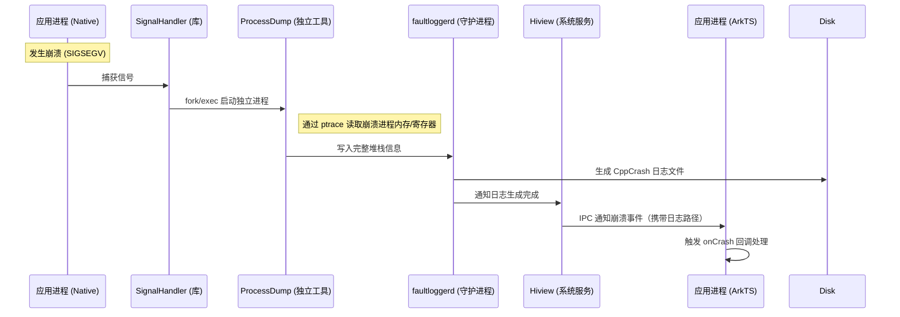
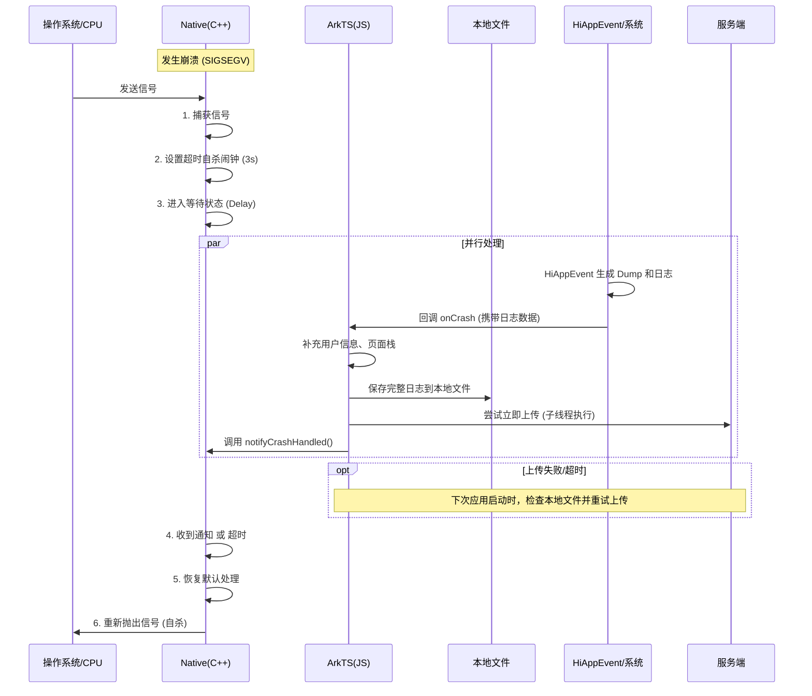
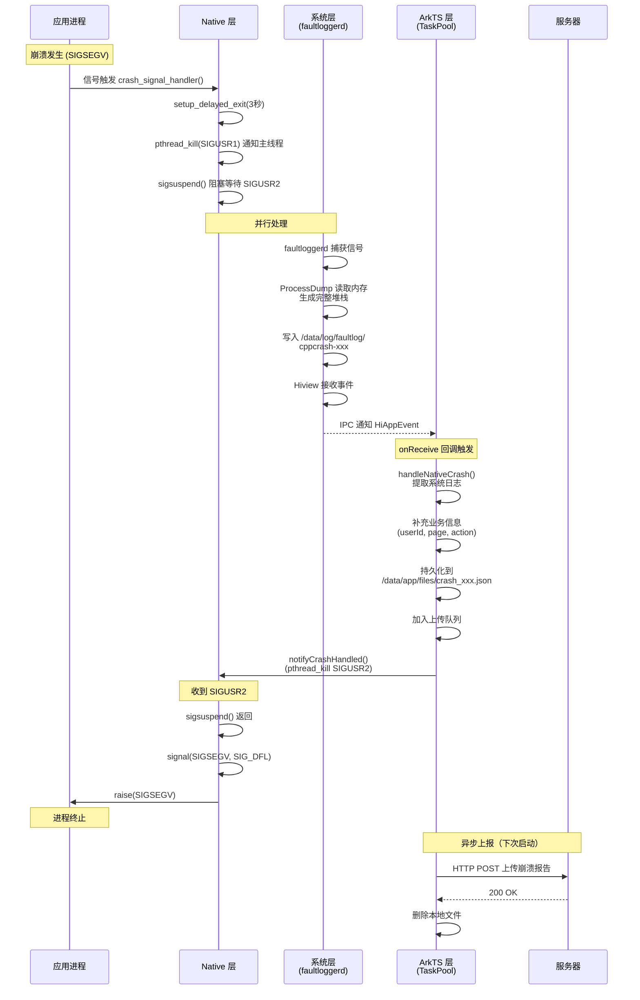

# OpenHarmony APM Native Crash 监控架构设计

## 概述

本文档阐述 OpenHarmony 平台 APM SDK 中 Native Crash 监控方案的技术架构设计。文档涵盖方案演进历程、技术选型对比、架构实现细节及关键技术挑战的解决方案。

**适用场景**：OpenHarmony 应用性能监控（APM）、崩溃日志采集、实时故障诊断

**技术栈**：C++ Signal Handling、NAPI、HiAppEvent、TaskPool、faultloggerd

## 1. 技术方案选型

### 1.1 方案概览

本章节对比分析三种主流 Native Crash 监控技术方案，从技术可行性、系统兼容性和实施复杂度等维度进行评估：

### 1.2 方案 A：Breakpad/Minidump 方案

#### 技术原理

**核心机制**：进程内异常捕获与二进制转储

*   **信号拦截**：通过 `sigaction()` 注册 POSIX 信号处理器（Signal Handler），捕获 SIGSEGV、SIGABRT 等崩溃信号
*   **上下文快照**：信号触发时，暂停所有线程，采集 CPU 寄存器状态、线程调用栈、内存映射表（`/proc/self/maps`）等运行时信息
*   **Minidump 生成**：将采集的上下文信息序列化为 Minidump 二进制格式，写入本地存储
#### 实现流程（参考 Android 平台）

**阶段 1：初始化**
*   JNI 桥接：Java 层通过 JNI 调用 Native 初始化函数
*   异常处理器初始化：实例化 `google_breakpad::ExceptionHandler`，注册信号处理器
*   辅助线程预创建：启动 Filter 和 Dump 两个辅助线程并挂起，用于在信号处理上下文中安全执行回调（规避 Async-Signal-Unsafe 问题）

**阶段 2：崩溃捕获**
*   信号拦截：Breakpad 捕获崩溃信号，挂起崩溃线程
*   调用栈回溯：唤醒 Filter 线程，通过 JNI 获取 Java 调用栈（用于定位 Native 调用源头）
*   Minidump 生成：采集 CPU 寄存器、线程栈、内存映射等信息，写入 `.dmp` 文件
*   通知上层：唤醒 Dump 线程，通过 JNI 回调 Java 层 `onNativeCrash` 方法
*   进程终止：恢复默认信号处理（`SIG_DFL`），重新抛出信号，进程退出

**阶段 3：持久化与上报**
*   日志归档：Java 层接收通知，定位 `.dmp` 文件，生成包含设备信息的元数据 JSON，归档到统一目录
*   磁盘管理：检查存储空间，不足时采用内存缓存
*   独立进程上传：通过 `android:process` 启动独立 Service 进程（`:crash`），进行日志打包、加密、上传（HTTP POST），成功后删除本地文件
#### 技术局限

| 维度 | 问题描述 | 影响 |
|------|---------|------|
| **体积开销** | 编译后库体积 600KB - 1MB | 显著增加应用包体积 |
| **符号化依赖** | Minidump 为二进制格式，需服务端符号表解析 | 无法在端侧直接分析 |
| **实时性受限** | 信号处理器中禁止网络 I/O（Async-Signal-Unsafe 约束） | 仅能延迟上报，用户感知差 |
| **平台兼容性** | 依赖 POSIX 信号机制和内存布局假设 | 跨平台适配成本高 |


#### 延伸分析：为什么 OpenHarmony 无法复刻 Android 方案？

**核心障碍：Async-Signal-Safe (异步信号安全)**

这是所有 POSIX 系统（Linux/Android/OpenHarmony）通用的铁律。当 SIGSEGV（段错误）发生时，当前线程处于极度不稳定的状态（堆内存可能已损坏，锁可能未释放）。此时只能调用极少数被标记为“异步信号安全”的系统调用（如 `write`, `open`, `fork` 等）。

虽然 Android 方案通过预创建辅助线程或启动独立进程绕过了部分限制，但在 OpenHarmony 上复刻该方案面临三大核心障碍：

| 维度 | Android (Java/JNI) | OpenHarmony (ArkTS/NAPI) | 核心障碍 |
| :--- | :--- | :--- | :--- |
| **1. 线程模型** | **共享内存模型**<br>C++ 线程可通过 JNI 直接操作 Java 对象，虽然危险但技术上可行。 | **Actor 模型 (内存隔离)**<br>Native 线程与 ArkTS 线程内存隔离，无法直接操作对象，必须通过 NAPI 通信。 | **无法直接调用** |
| **2. 通信机制** | **JNI 调用**<br>JNI 接口相对底层，部分操作在崩溃时仍有一线生机。 | **NAPI 调用**<br>NAPI 内部涉及复杂的锁和内存分配。在 Signal Handler 中调用 NAPI 是 **Async-Signal-Unsafe** 的。 | **死锁风险 (Deadlock)** |
| **3. 救生通道** | **独立进程 (Service)**<br>可通过 `android:process` 和 `startService` (Binder) 启动独立进程上传。 | **Ability/Extension**<br>启动新进程需调用 ArkTS API (如 `childProcessManager`)，受限于 NAPI 死锁问题。 | **无法启动新进程** |

**结论**：
*   **Android 方案**：属于 **“内部自救”**。依赖应用自身在崩溃边缘的挣扎（JNI/Binder），风险较高但生态成熟。
*   **OpenHarmony 方案**：必须采用 **“外部救援”**。由于 NAPI 的“生死线”阻隔，应用无法自救，必须依赖系统服务 (`faultloggerd`) 来完成现场保留和日志生成。

### 1.3 方案 B：Fork 子进程 + 轮询检测方案

**方案背景**：针对方案 A 存在的两个核心问题：
1. **体量问题**：Breakpad 库体积过大（600KB - 1MB），且未能解决实时上报的核心需求
2. **通信限制**：信号处理函数中无法调用 NAPI（Async-Signal-Unsafe），导致无法直接通知 ArkTS 层崩溃发生

方案 B 通过 `fork()` 子进程 + 轮询机制来解决上述问题。

#### 技术原理

**核心机制**：利用 `fork()` 系统调用创建子进程进行日志持久化 + ArkTS 线程轮询检测

*   **进程克隆**：在信号处理器中调用 `fork()`，创建子进程继承父进程内存空间（Copy-on-Write）
*   **执行流隔离**：子进程拥有独立的执行上下文，可安全执行文件 I/O、内存分配等操作
*   **JSON 序列化**：在子进程中将崩溃上下文序列化为 JSON 格式，写入本地文件
*   **状态共享**：通过共享内存或全局变量标志位，Native 层标记崩溃状态
*   **TaskPool 轮询**：**由于主线程可能因崩溃而卡死，轮询检测必须在独立的 TaskPool 子线程中执行**，通过定时器（`setInterval`）轮询检查 Native 层的崩溃标志位

#### 实现流程

1. **初始化阶段**：Native 层设置崩溃标志位 `g_crash_detected`，**ArkTS 在 TaskPool 子线程中**启动定时器（如 100ms 间隔）轮询该标志位
2. **崩溃捕获阶段**：信号处理器中，设置 `g_crash_detected = true` 并写入崩溃信息到 `g_crash_info`，然后 `fork()` 子进程写入 JSON 日志文件，父进程 `sleep(3)` 等待 ArkTS 处理
3. **轮询检测阶段**：**TaskPool 子线程**的定时器检测到标志位为 true 后，通过 NAPI 读取崩溃信息，补充业务数据并上报服务器，最后停止轮询
4. **进程退出阶段**：Native 层等待超时后，恢复默认信号处理 `SIG_DFL`，重新抛出信号，进程终止

#### 技术优势

**解决的核心问题**：
1. **轻量化替代**：相比 Breakpad 体量过大（600KB - 1MB）且无法实现实时上报的问题，方案 B 通过 `fork()` + JSON 序列化实现轻量化崩溃日志生成
2. **规避 NAPI 限制**：轮询机制巧妙规避了信号处理函数中无法调用 NAPI（Async-Signal-Unsafe）通知 ArkTS 层的限制，通过标志位实现 Native 与 ArkTS 的松耦合通信

**其他优势**：
*   规避 Async-Signal-Safe 限制，可在子进程中执行任意操作
*   日志格式可读性强（JSON），便于端侧分析
*   实现轻量，无需引入第三方库
*   **轮询机制解耦**：Native 与 ArkTS 通过标志位松耦合，无需复杂的 IPC

#### 技术风险

| 风险类型 | 风险描述 | 后果 |
|---------|---------|------|
| **死锁隐患** | 多线程环境下，若 `fork()` 时父进程持有互斥锁，子进程中该锁永不释放 | 子进程挂起，日志丢失 |
| **资源竞争** | 父子进程共享文件描述符，可能导致资源冲突 | 文件损坏或写入失败 |
| **内存膨胀** | 子进程继承父进程完整内存空间 | 内存占用翻倍 |
| **轮询开销** | 持续轮询消耗 CPU 资源，100ms 间隔可能延迟检测 | 性能损耗，上报延迟 |
| **时序竞态** | 若 Native 进程在 ArkTS 检测前终止，标志位可能丢失 | 崩溃上报失败 |

### 1.4 方案 C：Crash Delayer + HiAppEvent（当前方案）

**方案背景**：方案 B 虽然解决了 Breakpad 的体量问题和 NAPI 调用限制，但引入了新的技术风险：
1. **多线程死锁**：`fork()` 在多线程环境下容易导致子进程死锁（若崩溃时持有锁）
2. **资源消耗过大**：子进程继承父进程完整内存空间（内存占用翻倍），持续轮询消耗 CPU 资源，整体不够轻量
3. **时序竞态风险**：若进程在 TaskPool 检测前终止，崩溃上报失败
4. **堆栈质量受限**：自行采集的堆栈信息不完整，缺少系统级深度诊断能力（如无法获取所有线程快照、内核态信息、系统日志关联等只有系统服务才能采集的内容）

方案 C 通过完全依赖 OpenHarmony 系统服务（faultloggerd + HiAppEvent）并使用 Crash Delayer 延迟退出机制来彻底解决上述问题，实现**极致轻量**（代码量 < 500 行，无内存膨胀）和**系统级堆栈质量**（利用 ProcessDump 工具获取完整进程快照和系统日志）。

#### 技术原理

**设计理念**：系统协同 + 延迟退出

*   **系统服务依赖**：完全依赖 OpenHarmony DFX 子系统（`faultloggerd` + `HiAppEvent`）生成高质量堆栈信息
*   **延迟退出机制**：Native 层捕获信号后，通过 `sigsuspend()` 阻塞崩溃线程，延长进程生命周期（Crash Delayer）
*   **异步通知**：等待系统完成日志采集后，通过 IPC 回调 ArkTS 层，完成业务数据补充和实时上报
*   **协同退出**：ArkTS 处理完成后，通过 NAPI 发送 `SIGUSR2` 信号，唤醒崩溃线程，优雅退出

#### 技术优势

| 优势 | 说明 |
|------|------|
| **系统级质量** | 利用系统 ProcessDump 工具，堆栈信息完整准确 |
| **轻量集成** | 无需引入第三方库，代码量 < 500 行 |
| **实时上报** | 通过 Crash Delayer 机制，实现崩溃瞬间上报（3s 内） |
| **平台适配** | 深度集成 OpenHarmony 生态，无跨平台兼容性问题 |

---

## 2. 技术决策分析

### 2.1 方案选型依据

基于对 OpenHarmony 崩溃处理机制的深入分析，**方案 C（Crash Delayer + HiAppEvent）**在以下关键指标上具有显著优势：

| 评估维度 | 方案 A | 方案 B | 方案 C |
|---------|--------|--------|--------|
| **实时性** | ❌ 延迟上报 | ❌ 延迟上报 | ✅ 实时上报（< 3s） |
| **集成成本** | ⚠️ 高（依赖第三方库） | ⚠️ 中（需精细控制） | ✅ 低（系统原生支持） |
| **可靠性** | ⚠️ 符号化依赖 | ⚠️ 死锁风险 | ✅ 系统级保障 |
| **维护成本** | ❌ 高 | ⚠️ 中 | ✅ 低 |

**结论**：方案 C 是当前平台唯一能实现**崩溃瞬间实时上报**的技术路径。

### 2.2 系统协作机制解析

#### HiAppEvent 架构原理

`HiAppEvent` 是 OpenHarmony DFX（Design for X）子系统的核心组件，采用**系统服务 + 进程间通信（IPC）**的架构模式。

**核心组件**：
*   **faultloggerd**：系统级守护进程，负责崩溃信号捕获和堆栈生成
*   **ProcessDump**：独立工具进程，通过 `ptrace` 读取崩溃进程内存
*   **Hiview**：事件分发服务，负责 IPC 通知和日志持久化
*   **HiAppEvent Runtime**：应用进程内运行时，提供事件订阅接口

#### 工作原理图解


#### 详细流程
1.  **信号拦截**：应用启动时，`faultloggerd` 提供的 `SignalHandler` 库注册到应用进程
2.  **外部快照**：崩溃时，`SignalHandler` 通过 `fork/exec` 启动独立的 **`ProcessDump`** 工具进程，从外部通过 `ptrace` 系统调用读取崩溃进程的内存和寄存器状态，生成完整堆栈
3.  **IPC 通知**：`faultloggerd` 生成日志后通知 **Hiview** 服务，Hiview 再通过 Binder IPC 将崩溃事件分发回应用的 ArkTS 运行时
4.  **事件回调**：ArkTS 运行时触发 `HiAppEvent.addWatcher` 注册的监听器回调，应用层获取崩溃数据

### 2.3 时序竞态分析

#### 进程终止竞态问题

Native Crash 场景存在典型的**进程生命周期竞态条件**：

**竞态双方**：
*   **进程 A（崩溃线程）**：信号触发 → 默认处理 → **进程立即终止**（耗时约 10ms）
*   **流程 B（系统回调链）**：日志生成 → IPC 通知 → ArkTS 回调执行（耗时约 200-500ms）

**无 Crash Delayer 情况**：
流程 A 瞬间完成，进程被操作系统回收。此时流程 B 的 IPC 消息可能刚发出或刚到达，但应用进程已销毁，ArkTS 线程停止调度，回调函数无法执行。

**结果**：本次崩溃的实时上报丢失，只能等待下次启动时补报（用户体验劣化）。

#### Crash Delayer 解决方案

通过在崩溃线程上设置**阻塞等待**（`sigsuspend`），将进程终止时间延迟至 ArkTS 回调完成后：

**时序保障**：
```
T+0ms    : 崩溃信号触发
T+1ms    : sigsuspend() 阻塞崩溃线程（进程保持存活）
T+50ms   : faultloggerd 完成日志生成
T+200ms  : HiAppEvent IPC 回调触发
T+400ms  : ArkTS 业务数据补充完成
T+450ms  : notifyCrashHandled() 发送 SIGUSR2
T+460ms  : sigsuspend() 返回，进程退出
```

**结果**：成功实现崩溃瞬间的实时上报，用户无感知延迟。

---

## 3. 当前架构设计

### 3.1 完整时序图



### 3.2 关键组件实现

#### 3.2.1 Native 层实现 (`signal_handler.cpp`)

**核心职责**：Crash Delayer - 通过信号机制延长进程生命周期

**实现细节**：

```cpp
// ==================== 全局变量 ====================
volatile bool g_crash_detected = false;
char g_last_crash_name[64] = {0};
char g_last_crash_reason[128] = {0};
pthread_t g_main_thread_id = 0;
pthread_t g_crash_thread_id = 0;
const int CRASH_NOTIFY_SIG = SIGUSR1;
const int ARKTS_DONE_SIG = SIGUSR2;
volatile int g_pending_crash_signal = 0;
volatile bool g_arkts_done = false;
int g_crash_timeout = 3;  // 默认3秒超时

// ==================== 延迟退出机制 ====================

// SIGALRM 处理函数：超时强制退出
static void alarm_handler(int sig) {
    OH_LOG_Print(LOG_APP, LOG_WARN, 0xFF00, "NativeCrashHandler", 
                 "Timeout waiting for ArkTS, force exit");
    if (g_pending_crash_signal != 0) {
        signal(g_pending_crash_signal, SIG_DFL);
        sigset_t set;
        sigemptyset(&set);
        sigaddset(&set, g_pending_crash_signal);
        sigprocmask(SIG_UNBLOCK, &set, nullptr);
        raise(g_pending_crash_signal);
    } else {
        _exit(1);
    }
}

// ArkTS 完成信号处理函数
static void arkts_done_handler(int sig) {
    g_arkts_done = true;
    OH_LOG_Print(LOG_APP, LOG_INFO, 0xFF00, "NativeCrashHandler", 
                 "Received ArkTS done signal, exiting gracefully");
}

// 设置延迟退出环境
void setup_delayed_exit(int sig, int timeout_seconds) {
    g_pending_crash_signal = sig;
    g_crash_thread_id = pthread_self();
    g_arkts_done = false;
    
    // 注册 ArkTS 完成信号处理函数
    struct sigaction done_sa = {};
    done_sa.sa_handler = arkts_done_handler;
    sigemptyset(&done_sa.sa_mask);
    sigaction(ARKTS_DONE_SIG, &done_sa, nullptr);
    
    // 注册 SIGALRM 超时处理函数
    struct sigaction alarm_sa = {};
    alarm_sa.sa_handler = alarm_handler;
    sigemptyset(&alarm_sa.sa_mask);
    sigaction(SIGALRM, &alarm_sa, nullptr);
    
    // 阻止原始崩溃信号，防止立即退出
    sigset_t set;
    sigemptyset(&set);
    sigaddset(&set, sig);
    sigprocmask(SIG_BLOCK, &set, nullptr);
    
    // 设置超时闹钟
    alarm(timeout_seconds);
}

// 等待 ArkTS 完成处理
void wait_for_arkts_and_exit() {
    sigset_t wait_set;
    sigfillset(&wait_set);
    sigdelset(&wait_set, SIGALRM);
    sigdelset(&wait_set, ARKTS_DONE_SIG);
    
    // 使用 sigsuspend 等待信号（ArkTS 完成或超时）
    while (!g_arkts_done) {
        sigsuspend(&wait_set);
        if (g_arkts_done) {
            OH_LOG_Print(LOG_APP, LOG_INFO, 0xFF00, "NativeCrashHandler", 
                         "ArkTS processing completed, exiting");
            break;
        }
    }
    
    // 取消 alarm
    alarm(0);
    
    // 正常退出
    _exit(0);
}

// ==================== 崩溃信号处理 ====================

static void crash_signal_handler(int sig, siginfo_t* info, void* context) {
    // 1. 防重入检查
    static volatile bool has_crashed = false;
    if (has_crashed) {
        _exit(1);
    }
    has_crashed = true;

    const char* signal_name = get_signal_name(sig);
    const char* signal_reason = get_signal_reason(sig, info);
    
    // 保存崩溃信息到全局变量
    strncpy(g_last_crash_name, signal_name, sizeof(g_last_crash_name) - 1);
    strncpy(g_last_crash_reason, signal_reason, sizeof(g_last_crash_reason) - 1);

    OH_LOG_Print(LOG_APP, LOG_WARN, 0xFF00, "NativeCrashHandler", 
                 "Native crash detected. (%s: %s)", signal_name, signal_reason);

    // 2. 设置延迟退出环境
    setup_delayed_exit(sig, g_crash_timeout);

    // 3. 通知主线程
    if (g_main_thread_id != 0) {
        pthread_kill(g_main_thread_id, CRASH_NOTIFY_SIG);
    }

    // 4. 等待 ArkTS 完成或超时
    wait_for_arkts_and_exit();

    // 5. 恢复默认信号处理并重新抛出
    signal(sig, SIG_DFL);
    raise(sig);
}

// 注册信号处理器
void register_signal_handlers() {
    struct sigaction sa;
    memset(&sa, 0, sizeof(sa));
    sa.sa_sigaction = crash_signal_handler;
    sigemptyset(&sa.sa_mask);
    sa.sa_flags = SA_SIGINFO | SA_ONSTACK;
    
    // 注册系统处理的崩溃信号
    sigaction(SIGSEGV, &sa, nullptr);  // 段错误
    sigaction(SIGABRT, &sa, nullptr);  // 程序中止
    sigaction(SIGFPE, &sa, nullptr);   // 浮点异常
    sigaction(SIGILL, &sa, nullptr);   // 非法指令
    sigaction(SIGBUS, &sa, nullptr);   // 总线错误
}
```

**关键设计要点**：
- ✅ **双信号协议**：SIGUSR1（通知主线程）+ SIGUSR2（ArkTS 完成通知）
- ✅ **sigsuspend 阻塞**：原子性信号等待机制，避免信号竞态
- ✅ **SIGALRM 超时保护**：即使 ArkTS 阻塞，3 秒后强制退出，防止进程僵死
- ✅ **防重入保护**：使用 volatile bool 标志位，确保信号处理器仅执行一次

---

#### 3.2.2 ArkTS 层实现 (`AppMonitorService.ets`)

**核心职责**：事件监听、数据聚合、上报调度

**关键流程**：

```typescript
export class AppMonitorService {
  start() {
    // 注册 HiAppEvent 监听器
    new EventsMonitor().start();
    
    // 订阅事件并处理
    EventChannel.getInstance().subscribeAll([
      EventType.NATIVE_CRASH, 
      EventType.APP_FREEZE
    ], async (eventType, eventInfo) => {
      try {
        // 1. 提取事件信息并保存到缓存
        const payload = await this.cacheService.saveToCache({ /* ... */ });
        
        // 2. 上报到服务器
        await APMCore.reportFile(payload);
        
      } finally {
        // 3. 通知 Native 层完成（关键：解除阻塞）
        if (eventType === EventType.NATIVE_CRASH) {
          notifyCrashHandled();  // 发送 SIGUSR2
        }
      }
    });
  }
}

// HiAppEvent 监听器
class EventsMonitor {
  start() {
    hiAppEvent.addWatcher({
      name: "apm_crash_watcher",
      onReceive: (domain, appEventGroups) => {
        // 转发到 EventChannel
        EventChannel.getInstance().emit(eventType, eventInfo);
      }
    });
  }
}
```

**关键设计要点**：
- ✅ **事件驱动架构**：EventChannel 实现生产者-消费者解耦
- ✅ **finally 块保障**：无论成功失败，确保通知 Native 层解除阻塞（防止进程永久挂起）
- ✅ **统一上报接口**：APMCore.reportFile 封装重试逻辑和网络异常处理

---

#### 3.2.3 系统层协作 (`HiAppEvent` + `faultloggerd`)

**系统组件**：
1. **faultloggerd 守护进程**：负责捕获崩溃信号、生成堆栈
2. **ProcessDump 工具**：外部读取进程内存、寄存器
3. **Hiview 服务**：事件分发、IPC 通知
4. **HiAppEvent 运行时**：应用侧事件订阅接口

**生成的日志内容**：
```json
{
  "time": 1703232000000,
  "type": "CPP_CRASH",
  "foreground": true,
  "bundle_version": "1.0.0",
  "bundle_name": "com.example.app",
  "pid": 12345,
  "uid": 20010001,
  "exception": {
    "message": "Segmentation fault",
    "name": "SIGSEGV",
    "stack": [
      "#00 pc 0x00012345 /system/lib/libc.so",
      "#01 pc 0x00023456 /data/app/lib/libapp.so (crash_test+0x10)",
      "#02 pc 0x00034567 /data/app/lib/libapp.so (main+0x20)"
    ]
  },
  "hilog": [
    "12-22 10:30:00.123  1234  5678 I APP: User clicked button",
    "12-22 10:30:00.456  1234  5678 E APP: About to crash"
  ],
  "external_log": [
    "/data/log/faultlog/cpp/cppcrash-12345-20231222-103000"
  ]
}
```

**核心能力**：
- ✅ **完整堆栈信息**：包含符号化的函数名、偏移量、so 库路径
- ✅ **寄存器快照**：崩溃瞬间的 CPU 寄存器值（用于深度分析）
- ✅ **内存映射表**：所有加载的共享库地址范围（`/proc/self/maps`）
- ✅ **系统日志集成**：崩溃前的 hilog 日志（最近 100 行）
- ✅ **详细报告文件**：保存到 `/data/log/faultlog/cpp/cppcrash-{pid}-{timestamp}`

---

### 3.3 完整数据流转



**时间线**：
- `T+0ms`: 崩溃发生，信号捕获
- `T+1ms`: 设置延迟退出，通知主线程
- `T+50ms`: faultloggerd 开始生成堆栈
- `T+200ms`: HiAppEvent 回调触发
- `T+300ms`: 业务信息补充完成
- `T+350ms`: 本地持久化完成
- `T+400ms`: notifyCrashHandled() 调用
- `T+450ms`: Native 层收到信号，进程退出
- `T+1000ms ~ T+5000ms`: 上传到服务器（异步，可能失败）

**容错机制**：
- ❌ **上传失败**：本地文件保留，下次启动时重试
- ⏱️ **ArkTS 超时**：3 秒看门狗触发，强制退出
- 🔄 **网络异常**：30 秒请求超时，保留到队列重试

---

### 3.4 性能与可靠性保障

#### 3.4.1 性能优化

| 优化点 | 实现方式 | 效果 |
|--------|---------|------|
| **非阻塞主线程** | TaskPool LongTask 运行监控逻辑 | 主线程性能影响 < 1ms |
| **最小化信号处理** | 仅设置延迟退出，等待 ArkTS 回调 | 信号处理函数 < 5ms |
| **异步上报** | 事件驱动，不阻塞崩溃处理流程 | 上报延迟不影响进程退出 |
| **本地缓存** | 仅保存必要字段 | 单个崩溃文件 < 50KB |

#### 3.4.2 可靠性保障

| 风险点 | 保障措施 | 降级策略 |
|--------|---------|---------|
| **ArkTS 卡死** | SIGALRM 超时强制退出 | 3 秒后自动退出 |
| **网络失败** | 本地持久化 + 下次启动重试 | 最多保留 100 个历史崩溃 |
| **磁盘满** | 检查可用空间，超过配额删除旧文件 | 保留最近 10 个崩溃 |
| **系统回调延迟** | Crash Delayer 延长进程生命 | 最长等待 3 秒 |
| **多线程竞争** | 使用原子变量和信号机制 | sigsuspend 安全阻塞 |

---

## 4. 跨线程数据同步挑战与解决方案

### 4.1 问题背景

为避免 APM 监控逻辑阻塞 UI 主线程，核心逻辑（包括 `HiAppEvent` 监听与处理）在独立的 **Worker 子线程** 中执行。

### 4.2 技术挑战

在初始化配置时，业务方可传入 `setUserIdFunc` 回调函数获取用户 ID。但由于 ArkTS 采用 **Actor 内存隔离模型**，导致：

1.  **跨线程调用限制**：主线程传入的 `setUserIdFunc` 无法在子线程中直接调用
2.  **上下文丢失**：函数所引用的主线程闭包变量在子线程中不可访问

### 4.3 解决方案：状态推送模式

**架构调整**：从"崩溃时拉取"改为"状态变更时推送"

**实现方式**：
1.  **废弃回调模式**：不再依赖 `setUserIdFunc` 在崩溃瞬间获取 ID
2.  **主动推送接口**：
    *   提供 `setUserId(id: string)` 静态方法
    *   业务层在用户登录/切换账号时主动调用
    *   APM SDK 将 User ID 缓存到子线程本地存储
3.  **崩溃时读取**：崩溃发生时，子线程直接从本地缓存读取最新 User ID，无需跨线程通信

**技术优势**：
- ✅ 规避 Actor 模型的跨线程限制
- ✅ 降低崩溃时的数据获取延迟
- ✅ 提高数据可靠性（缓存持久化，崩溃后仍可读取）

---

## 5. 架构总结与技术展望

### 5.1 架构总结

本方案通过 **Crash Delayer 延迟退出机制** 与 **HiAppEvent 系统服务协同**，在崩溃瞬间构建了完整的实时数据链路：

```
Native Crash → sigsuspend 阻塞 → faultloggerd 采集 → IPC 通知 ArkTS 
→ 业务数据补充 → 实时上报 → SIGUSR2 唤醒 → 进程退出
```

**核心价值**：
*   ✅ **实时性保障**：崩溃瞬间完成数据采集和上报，用户无感知延迟
*   ✅ **系统级质量**：利用系统 ProcessDump，堆栈信息准确完整（包含符号化函数名、寄存器快照、内存映射）
*   ✅ **架构轻量**：无第三方依赖，核心代码量 < 500 行，维护成本低
*   ✅ **平台深度适配**：深度集成 OpenHarmony DFX 子系统，稳定性有保障

### 5.2 技术演进方向

**短期优化**：
*   **性能优化**：进一步降低 Crash Delayer 对进程退出时延的影响（目标 < 100ms）
*   **容错增强**：增加 HiAppEvent 回调超时、网络异常等边界场景的处理
*   **数据增强**：集成更多运行时上下文信息（内存使用、线程状态、自定义标签）

**长期探索**：
*   **跨设备形态支持**：探索适配其他 OpenHarmony 设备形态（轻量系统、小型系统）
*   **AI 辅助分析**：结合堆栈信息和业务数据，进行崩溃根因自动推断
*   **多场景扩展**：将 Crash Delayer 机制推广到 ANR、低内存等其他故障场景

---
