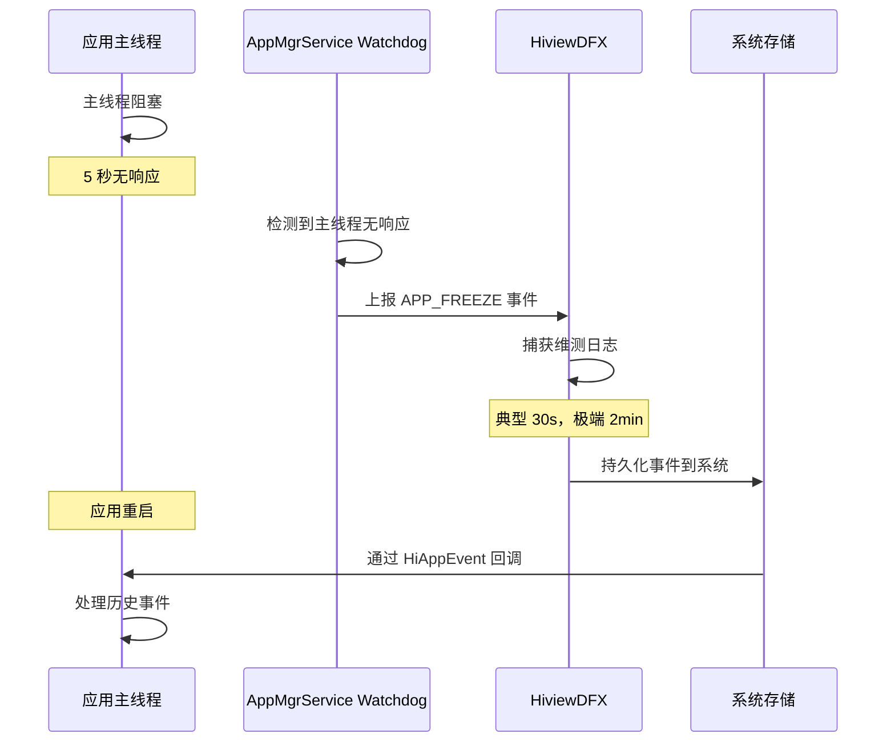
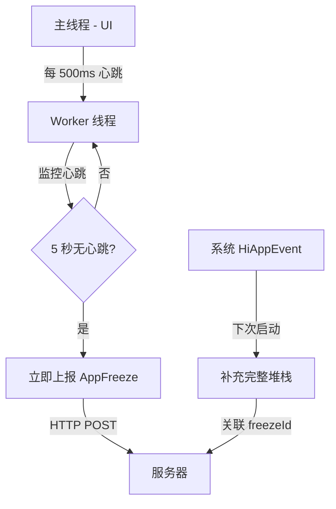

# OpenHarmony AppFreeze 监控设计方案

## 1. AppFreeze 概述

### 1.1 什么是 AppFreeze？

**AppFreeze**（应用冻屏/应用卡死）是指应用主线程长时间无响应，导致用户界面卡死的异常状态。

> **官方术语**：HarmonyOS 官方文档中称为"应用冻屏事件"（APP_FREEZE）。

**触发条件**：
- 主线程被阻塞超过**约 5 秒**（THREAD_BLOCK_6S 类型）
  - 前台：6 秒检测时长
  - 后台：21 秒检测时长（系统对后台应用检测更宽松）
- 无法响应系统事件（触摸、按键等）
- 用户感知：应用完全卡住，无法操作

**典型场景**：
```typescript
// 场景 1: 主线程同步耗时操作
Button("触发卡死").onClick(() => {
  let start = Date.now();
  while (Date.now() - start < 10000) {
    // 主线程阻塞 10 秒
  }
});

// 场景 2: 死循环
Button("死循环").onClick(() => {
  while (true) {
    // 永久阻塞
  }
});

// 场景 3: 死锁
let lock1 = new Object();
let lock2 = new Object();
// 线程 A 持有 lock1 等待 lock2
// 线程 B 持有 lock2 等待 lock1
```

---

## 2. AppFreeze 检测机制

### 2.1 系统检测流程



**关键特征**：
1. **外部检测**：由系统进程 `AppMgrService` 的 Watchdog 监控
2. **无信号通知**：不会向应用进程发送信号（与 Native Crash 不同）
3. **延迟通知**：事件在下次启动时才能被应用获取

---

### 2.2 与 Native Crash 的核心差异

| 维度 | Native Crash | AppFreeze |
|------|-------------|-----------|
| **触发源** | 应用进程内部信号<br>（SIGSEGV, SIGABRT等） | 系统外部检测<br>（AppMgrService Watchdog） |
| **检测位置** | 进程内（signal handler） | 系统进程（独立检测） |
| **进程状态** | 信号触发后立即终止 | 初期存活（5秒内）<br>超时后可能被系统杀死 |
| **信号通知** | ✅ 有（SIGSEGV等） | ❌ 无（无信号发送给应用） |
| **可捕获性** | ✅ 可以（signal handler） | ❌ 不可以（无信号可捕获） |
| **主线程状态** | 通常正常运行 | 阻塞（这是问题本身） |
| **回调执行时机** | ✅ 立即（3秒内） | ⚠️ 延迟（下次启动时） |
| **Crash Delayer 作用** | ✅ 关键（延长进程以完成实时上报） | ❌ 无效（回调被系统延迟，无法实时） |
| **实时上报** | ✅ 可以 | ❌ 不可以（延迟到下次启动） |
| **上报时机** | 崩溃瞬间（3秒内） | 下次应用启动时 |
| **解决方案** | Crash Delayer + HiAppEvent | Worker Watchdog + 自实现检测 |

---

## 3. 系统 HiAppEvent 机制分析

### 3.1 官方文档说明/js-apis-hiviewdfx-hiappevent)（最新版本，2025-12-18）：

> **针对异常退出时产生的崩溃事件（hiAppEvent.event.APP_CRASH）和应用冻屏事件（hiAppEvent.event.APP_FREEZE），系统捕获维测日志有一定耗时，典型情况下30s内完成，极端情况下2min左右完成。在手动处理订阅事件的方法中，由于事件可能未生成或日志信息未抓取完成dwatcher)：

> **针对异常退出时产生的崩溃事件（hiAppEvent.event.APP_CRASH）和卡死事件（hiAppEvent.event.APP_FREEZE），系统捕获维测日志有一定耗时，典型情况下30s内完成，极端情况下2min左右完成。在手动处理订阅事件的方法中，建议在进程启动后延时重试调用takeNext()获取此类事件。**

**关键信息**：
1. ✅ **APP_FREEZE 会生成事件** - 这是系统行为
2. ✅ **需要延时获取** - 官方明确说明"建议在进程启动后延时重试调用 takeNext()"
3. ✅ **系统捕获有耗时** - 典型 30s，极端 2min
4. ✅ **通过 holder.takeNext() 获取** - 不是通过实时回调 onReceive

---

### 3.2 AppFreeze 事件流程

```
AppFreeze 发生（主线程阻塞）：
  1. 系统检测到 AppFreeze (约 5 秒后)
  2. HiviewDFX 生成事件并开始捕获维测日志
  3. ⚠️ 系统捕获日志需要时间（典型30s，极端2min）
  4. 日志捕获完成后持久化到系统
  
应用重启：
  5. TaskPool 线程启动，HiAppEvent watcher 重新注册
  6. ✅ 系统读取历史事件，触发回调
  7. ✅ AppMonitorService 收到 APP_FREEZE 事件
  8. 正常保存和上报
```

**系统通信流**：
```
系统侧（进程外）：
  AppMgrService Watchdog → 检测主线程无响应
      ↓
  HiviewDFX 生成事件
      ↓
  系统捕获维测日志（30s~2min）
      ↓
  ⚠️ 回调延迟到下次启动执行（系统设计）
      ↓
  应用重启时通过 holder.takeNext() 获取
```

**结论**：
- AppFreeze 的延迟不是 bug，而是**系统设计**
- 官方推荐的处理方式就是**下次启动时通过 holder.takeNext() 获取**
- 如果需要实时监控，必须自己实现 Worker Watchdog

---

## 4. AppFreeze 故障类型与分析方法

### 4.1 故障日志关键信息提取

> 参考官方文档：[应用冻屏问题排查方法](https://developer.huawei.com/consumer/cn/doc/best-practices/bpta-stability-app-freeze-way)

#### 4.1.1 基本信息查看

**1. 进程号（Pid）**
```
搜索关键词: "Pid"
用途: 过滤进程堆栈、关联 hilog 日志
```

**2. 故障类型（Reason）**
```
常见类型:
- THREAD_BLOCK_6S: 主线程阻塞（前台 6s，后台 21s）
- APP_INPUT_BLOCK: 用户输入响应超时（应用必为前台）
- LIFECYCLE_TIMEOUT: 生命周期超时（查看 MSG reason 部分）
```

**3. 故障上报时间（Fault time）**
```
搜索关键词: "Fault time"
注意: 与日志中多处 "TIMESTAMP" 区分，Fault time 最接近实际故障上报时间
```

**4. 前后台状态（Foreground）**
```
搜索关键词: "Foreground"
用途: 判断检测时长（前台 6s / 后台 21s）
```

**5. 故障检测时间区间**
```
计算方式: [Fault time - 检测时长, Fault time]
例如: Fault time = 12:17:43，检测时长 = 6s
      故障区间 = [12:17:37, 12:17:43]
```

---

### 4.2 EventHandler 信息分析

#### 4.2.1 Current Running 分析

```
EventHandler dump begin curTime: 2024-08-08 12:17:43.544
Event runner (Thread name = , Thread ID = 35854) is running
Current Running: start at 2024-08-08 12:17:16.629, 
  Event { send thread = 35882, 
         send time = 2024-08-08 12:17:16.628, 
         handle time = 2024-08-08 12:17:16.629, 
         trigger time = 2024-08-08 12:17:16.630,  // 任务开始运行时间
         task name = , 
         caller = xxx }
```

**分析要点**：
```typescript
当前任务运行时长 = dump begin curTime - trigger time
// 示例: 12:17:43.544 - 12:17:16.630 = 27 秒

if (当前任务运行时长 > 故障检测时长) {
  // 当前任务就是导致卡死的任务
  排查方向: 该任务内部逻辑超时
} else {
  // 当前任务只是检测区间内运行的任务之一
  排查方向: 主线程繁忙，watchdog 无法调度执行
}
```

---

#### 4.2.2 History Event Queue 分析

```
History event queue information:
  No. 0 : Event { send thread = 35854, 
                  send time = 2024-08-08 12:17:15.525, 
                  handle time = 2024-08-08 12:17:15.525, 
                  trigger time = 2024-08-08 12:17:15.527,
                  completeTime time = 2024-08-08 12:17:15.528,  // 任务完成时间
                  priority = High, id = 1 }
  No. 1 : Event { ..., completeTime time = 2024-08-08 12:17:15.527 }
  No. 2 : Event { ..., completeTime time = 2024-08-08 12:17:15.800 }
  No. 3 : Event { ..., completeTime time = 2024-08-08 12:17:16.629 }
  No. 4 : Event { ..., completeTime time = 2024-08-08 12:17:16.629 }
  No. 5 : Event { ..., completeTime time = ,  // 空值表示当前任务
                  priority = Low, task name =  }
```

**分析要点**：
```typescript
任务运行耗时 = completeTime time - trigger time

// 筛选故障检测区间内的任务
for (const event of historyQueue) {
  const startTime = event.trigger_time;
  const endTime = event.completeTime_time;
  
  if (startTime >= 故障开始时间 && endTime <= 故障结束时间) {
    const duration = endTime - startTime;
    if (duration > 阈值) {
      // 标记为可疑任务
      console.log(`耗时任务: ${event.task_name}, 耗时: ${duration}ms`);
    }
  }
}
```

---

#### 4.2.3 VIP Priority Queue 分析（Watchdog 检测）

```
VIP priority event queue information:
  No.1 : Event { send thread = 35862, 
                 send time = 2024-08-08 12:17:25.526, 
                 handle time = 2024-08-08 12:17:25.526, 
                 id = 1, 
                 caller = [watchdog.cpp(Timer:156)] }  // Watchdog 任务
  No.2 : Event { send time = 2024-08-08 12:17:28.526, 
                 caller = [watchdog.cpp(Timer:156)] }  // 间隔 3 秒
  No.3 : Event { send time = 2024-08-08 12:17:31.526, 
                 caller = [watchdog.cpp(Timer:156)] }  // 间隔 3 秒
  No.4 : Event { send time = 2024-08-08 12:17:34.530, 
                 caller = [watchdog.cpp(Timer:156)] }  // 间隔 3 秒
  ...
  No.10: Event { send time = 2024-08-08 12:17:15.410, 
                 task name = ArkUIWindowInjectPointerEvent,  // 用户输入事件
                 caller = [task_runner_adapter_impl.cpp(PostTask:33)] }
```

**关键说明**：
```
✅ Watchdog 任务特征:
   - caller = [watchdog.cpp(Timer:156)]
   - 每隔 3 秒发送一次
   - 位于 VIP 优先级队列
   - 仅针对 THREAD_BLOCK 任务类型

✅ 用户输入事件特征:
   - task name = ArkUIWindowInjectPointerEvent / MMI::OnPointerEvent
   - 也位于 VIP 优先级队列
   - 保障第一时间响应用户
```

**对比 warning/block 事件分析卡死原因**：

**场景 1：Watchdog 队列增长，首个任务不变**
```
warning 事件:
  No.1~4: watchdog 任务 (12:17:25 → 28 → 31 → 34)
  Total size: 4

block 事件:
  No.1~5: watchdog 任务 (12:17:25 → 28 → 31 → 34 → 37)
  Total size: 5  // 队列变长了
  
结论: ❌ 当前正在运行的任务卡死阻塞
      → 导致后续任务（包括 watchdog）堆积无法执行
```

**场景 2：Watchdog 队列增长，多个高优先级任务堆积**
```
warning 事件:
  No.1~100: 大量 ArkUIWindowInjectPointerEvent
  No.101: watchdog 任务
  
block 事件:
  No.1~200: 更多 ArkUIWindowInjectPointerEvent
  No.201: watchdog 任务
  
结论: ⚠️ 更高优先级队列任务堆积
      → 导致位于较低优先级的 watchdog 任务未被调度
```

---

### 4.3 堆栈信息分类（5 种场景）

> 参考：[应用冻屏问题排查方法 - 查看 stack 信息](https://developer.huawei.com/consumer/cn/doc/best-practices/bpta-stability-app-freeze-way#%E6%9F%A5%E7%9C%8Bstack%E4%BF%A1%E6%81%AF)

#### 场景 1：warning/block 栈一致 - 卡锁

```
Tid:3025, Name: xxx
# 00 pc 00000000001b4094 /system/lib/ld-musl-aarch64.so.1(__timedwait_cp+188)
# 01 pc 00000000001b9fc8 /system/lib/ld-musl-aarch64.so.1(__pthread_mutex_timedlock_inner+592)
# 02 pc 00000000000c3e40 /system/lib64/libc++.so(std::__h::mutex::lock()+8)  // 等锁卡死
# 03 pc 000000000007ac4c /system/lib64/platformsdk/libnative_rdb.z.so(...)
```

**分析方向**：
- 通过反汇编（llvm-addr2line）获取对应代码行
- 排查其他线程栈和代码上下文锁的使用
- 参考：[通过 llvm-addr2line 工具定位行号](https://developer.huawei.com/consumer/cn/doc/best-practices/bpta-stability-app-crash-cpp-way#li186453444512)

---

#### 场景 2：warning/block 栈一致 - 卡在 IPC 请求

```
Tid:53616, Name:xxx
# 00 pc 0000000000171c1c /system/lib/ld-musl-aarch64.so.1(ioctl+176)
# 01 pc 0000000000006508 /system/lib64/chipset-pub-sdk/libipc_common.z.so(...) // binder 卡死
# 02 pc 000000000004d500 /system/lib64/platformsdk/libipc_core.z.so(OHOS::BinderInvoker::TransactWithDriver...)
```

**分析方向**：
- 识别应用通过什么接口进行 IPC 请求（业务栈帧下面的接口）
- 识别对端是什么进程
- 结合 binder 调用链，确定对端阻塞没有返回的原因

---

#### 场景 3：warning/block 栈一致 - 卡在某业务栈帧

```
Tid:14727, Name:xxx
# 00 pc 00000000001c4c60 /system/lib/ld-musl-aarch64.so.1(pread+72)
# 01 pc 0000000000049154 /system/lib64/platformsdk/libsqlite.z.so(unixRead+180)
# 02 pc 0000000000053e98 /system/lib64/platformsdk/libsqlite.z.so(readDbPage+116)
```

**分析方向**：
- 结合 trace 进一步确认
- 排查是否为应用调用的单一函数内部逻辑执行超时
- 例如：数据库复杂查询、大文件读取、复杂计算等

---

#### 场景 4：瞬时栈 - warning/block 栈不一致

```
warning 栈:
  # 10 at getPageIndex (FolderData.ts:463)
  # 11 at anonymous (OpenFolderSwiperPage.ts:761)
  
block 栈:
  # 01 at anonymous (FolderData.ts:464)  // 不同位置
  # 02 at getPageIndex (FolderData.ts:463)
  # 03 at anonymous (OpenFolderSwiperPage.ts:761)
```

**判断**：
- 两个时刻是在线程运行过程中抓取的栈
- 此时进程未卡死，属于**线程繁忙场景**

**分析方向**：
- warning/block 栈可能存在相似性
- 结合 trace 和 hilog 判断应用具体运行场景
- 针对场景进行优化（降低复杂度、异步化处理）

---

#### 场景 5：eventhandler 栈 - 线程空闲

```
Tid:1778, Name:sapp.appgallery
# 00 pc 0000000000154c54 /system/lib/ld-musl-aarch64.so.1(epoll_wait+80)
# 01 pc 00000000000181e0 /system/lib64/chipset-pub-sdk/libeventhandler.z.so(...WaitFor...)
# 02 pc 00000000000201b0 /system/lib64/chipset-pub-sdk/libeventhandler.z.so(...WaitUntilLocked...)
```

**判断**：
- 当前线程 eventhandler 在等待任务提交
- 说明此时线程不繁忙

**分析方向**：
- 结合 trace 和 hilog 判断应用具体运行场景
- 可能是其他线程阻塞导致主线程无事可做

---

### 4.4 Binder 信息分析关键点

#### 4.4.1 Binder 调用链示例

```
PeerBinderCatcher -- pid==35854
BinderCatcher --
  35854:35854 to 52462:52462 code 16 wait:27.185s  // 应用主线程 → 对端进程
  52462:52462 to 1386:0 code 13 wait:24.733s       // 对端进程 → 系统服务
  ...
```

**调用链分析**：
```
35854:35854 (应用主线程)
    ↓ (等待 27 秒)
52462:52462 (某中间服务)
    ↓ (等待 24 秒)
1386:0 (系统服务，线程号为 0)
```

---

#### 4.4.2 典型问题场景

**场景 1：线程号为 0 - IPC FULL**

```
binderInfo:
  pid      context    request   started   max    ready  free_async_space
  1386     binder     1         15        16     0      517264
                                               ↑ ready=0，无空闲线程
```

**判断**：
- 该应用 IPC FULL，ipc 线程都在使用中
- 没有空闲线程分配来完成本次请求

**排查方向**：
- 分析其他 ipc 线程为什么不释放
- 常见：某一 ipc 线程持锁阻塞，导致其他线程等锁卡死

---

**场景 2：free_async_space 消耗殆尽**

```
binderInfo:
  pid      context    request   started   max    ready  free_async_space
  1386     binder     1         15        16     0      0
                                                        ↑ 无可用 buffer
```

**判断**：
- buffer 空间不足，导致新的 ipc 线程无法完成请求

**排查方向**：
- 同步和异步请求都会消耗该值
- 常见：短时间内大批量异步请求

---

**场景 3：waitTime 过小 - 非根因**

```
BinderCatcher:
  35854:35854 to 52462:52462 wait:0.5s  // 等待时间很短
```

**判断**：
- waitTime 远小于故障检测时长
- 本次 ipc 请求并不是卡死的根本原因

**典型场景**：
- 应用侧主线程在短时间内多次 ipc 请求
- 总请求时长过长导致故障

**排查方向**：
1. 单次请求是否在预期时长内（例如：规格 20ms 的接口达到 1s）
2. 应用侧频繁调用场景是否合理

---

**场景 4：无调用关系，栈却为 ipc 栈**

**判断**：
- 确定是否为瞬时栈（warning/block 栈是否一致）
- 可能：warning 为 ipc 栈，block 栈为其他瞬时栈
- 说明抓取 binder 时 ipc 请求已经结束

**注意**：
- binder 信息不是在故障时刻实时获取，有一定延迟
- THREAD_BLOCK 类型：存在半周期检测，binder 抓取较准确
- 其他类型：上报存在延迟，可能抓取到非现场 binder
- 结合 trace 分析更能直观查看 binder 耗时情况

---

### 4.5 HiLog 关键字搜索列表

> 参考：[应用冻屏问题排查方法 - 结合 HiLog 信息](https://developer.huawei.com/consumer/cn/doc/best-practices/bpta-stability-app-freeze-way#%E7%BB%93%E5%90%88hilog%E4%BF%A1%E6%81%AF)

**DFX 相关打印**：

| 关键字 | 用途 | 示例 |
|--------|------|------|
| `Start NotifyAppFault` | 故障上报时间点 | 确定流水中故障上报时间 |
| `In Background, thread may be blocked in, do not report this time` | 后台检测（5 次后上报） | 判断是否达到 21s |
| `DfxFaultLogger: Receive dump request` | 抓栈时间点（signal: 35） | 结合故障上报时间判断抓栈时机 |
| `hisysevent write result=0, send event [FRAMEWORK,PROCESS_KILL]` | 查杀原因记录 | 结合 AppRecovery 分析 |
| `is going to exit due to APP_FREEZE` | 应用退出时间点 | 判断是否在抓栈前退出 |

**一般分析步骤**：

```typescript
// 1. 确定故障上报时间点
搜索: "Start NotifyAppFault"
结果: 2024-08-08 12:17:43.544

// 2. 推断故障检测区间
const faultTime = "12:17:43.544";
const detectDuration = 6;  // THREAD_BLOCK_6S 前台
const startTime = faultTime - detectDuration;  // 12:17:37.544
const endTime = faultTime;  // 12:17:43.544

// 3. 判断该时间区间内应用主线程运行状态
过滤主线程日志: grep "Tid:35854" hilog.txt | grep "12:17:3[7-9]|12:17:4[0-3]"

// 场景 A: 主线程日志完全无输出
结论: 卡死在最后日志打印的接口调用处

// 场景 B: 主线程高频打印同类日志
结论: 分析对应输出表示的场景及其合理性（可能陷入循环）
```

---

## 5. 当前方案的局限性

### 4.1 系统 HiAppEvent 的问题

```typescript
// 当前实现（TaskPool 线程）
@Concurrent
function startServices() {
  APMCore.init(config).startServices();  // 注册 HiAppEvent
  setInterval(() => {}, 1000);  // 保持 TaskPool 运行
}

// AppMonitorService.ets
hiAppEvent.addWatcher({
  name: "apm_watcher",
  appEventFilters: [{
    domain: hiAppEvent.domain.OS,
    eventTypes: [hiAppEvent.EventType.FAULT]
  }],
  onReceive: (domain, appEventGroups) => {
    // ✅ Native Crash: 立即执行（3秒内）
    // ❌ AppFreeze: 不会执行（延迟到下次启动）
  }
});
```

**局限性**：
1. ❌ **无法实时上报** - AppFreeze 事件延迟到下次启动
2. ❌ **用户体验差** - 卡死时无法记录上下文（如当前页面、操作路径）
3. ❌ **依赖重启** - 如果用户不重启应用，事件永远不会上报
4. ⚠️ **上报延迟** - 典型 30s 捕获时间 + 等待重启

---

### 5.2 测试场景对比

| 测试场景 | Native Crash | AppFreeze (10秒阻塞) | AppFreeze (死循环) |
|---------|-------------|-------------------|------------------|
| **触发方式** | 空指针解引用 | `while(Date.now() - start < 10000)` | `while(true)` |
| **系统检测** | 立即 | ~5秒后 | ~5秒后 |
| **进程状态** | 信号捕获，延迟退出 | 正常运行，主线程卡住 | 正常运行，主线程卡住 |
| **当次回调** | ✅ 立即执行（3秒内） | ❌ 不执行 | ❌ 不执行 |
| **重启后回调** | N/A（已上报） | ✅ 执行 | ✅ 执行（如果重启） |
| **实时上报** | ✅ 成功 | ❌ 失败 | ❌ 失败 |
| **最终上报时机** | 崩溃瞬间 | 下次启动 | 下次启动 |

---

## 6. 实时监控方案设计

### 6.1 方案对比

#### **方案 A：系统 HiAppEvent（当前局限）**

```typescript
// 仅依赖系统检测
hiAppEvent.addWatcher({
  appEventFilters: [hiAppEvent.event.APP_FREEZE]
});
```

**优点**：
- ✅ 实现简单，无需额外代码
- ✅ 系统级日志完整（堆栈、线程状态）

**缺点**：
- ❌ 无法实时上报
- ❌ 依赖应用重启
- ❌ 丢失卡死时的业务上下文

**效果**：⚠️ 延迟上报（下次启动时）

---

#### **方案 B：Worker Watchdog（推荐）**

```typescript
// 主线程：定期发送心跳
setInterval(() => {
  worker.postMessage({ 
    type: 'heartbeat', 
    timestamp: Date.now(),
    context: {
      currentPage: router.getState().path,
      userAction: lastUserAction
    }
  });
}, 500);  // 每 500ms 发送一次

// Worker 线程：独立检测
let lastHeartbeat = Date.now();

worker.onmessage = (e) => {
  if (e.data.type === 'heartbeat') {
    lastHeartbeat = e.data.timestamp;
  }
};

setInterval(() => {
  const now = Date.now();
  if (now - lastHeartbeat > 5000) {
    // 检测到 AppFreeze
    reportFreezeToServer({
      freezeTime: now - lastHeartbeat,
      context: lastReceivedContext,
      timestamp: now
    });
  }
}, 1000);  // 每秒检测一次
```

**优点**：
- ✅ **实时检测**：5 秒内发现卡死
- ✅ **保留上下文**：卡死时的页面、操作等信息
- ✅ **不依赖重启**：立即上报到服务器
- ✅ **自主可控**：不受系统限制

**缺点**：
- ⚠️ 需要额外 Worker 线程
- ⚠️ 心跳机制增加开销（但极小）
- ⚠️ 日志不如系统级完整（无堆栈）

**效果**：✅ 实时上报（5-6 秒内）

---

#### **方案 C：Native Watchdog（备选）**

```cpp
// Native 线程：监控主线程心跳
void* watchdog_thread(void* arg) {
  while (true) {
    time_t now = time(nullptr);
    if (now - g_last_heartbeat > 5) {
      // 检测到冻结
      report_freeze_to_server();
      
      // 可选：等待 ArkTS 恢复
      wait_for_arkts_recovery();
    }
    sleep(1);
  }
}

// ArkTS 主线程：定期更新
setInterval(() => {
  updateHeartbeat();  // 调用 Native NAPI
}, 500);
```

**优点**：
- ✅ Native 线程稳定性更高
- ✅ 可以集成到现有 Native 模块

**缺点**：
- ⚠️ NAPI 调用开销
- ⚠️ 跨层通信复杂度
- ⚠️ 仍然无法获取完整堆栈

**效果**：✅ 可以实现类似 Crash Delayer 的机制

---

### 6.2 推荐方案：Worker Watchdog

#### 架构设计



#### 实现代码

**1. 主线程心跳发送**

```typescript
// entry/src/main/ets/entryability/EntryAbility.ets
import worker from '@ohos.worker';

export default class EntryAbility extends UIAbility {
  private watchdogWorker?: worker.ThreadWorker;
  private heartbeatTimer?: number;

  onCreate(want: Want, launchParam: AbilityConstant.LaunchParam): void {
    // 启动 Worker Watchdog
    this.watchdogWorker = new worker.ThreadWorker('entry/ets/workers/WatchdogWorker.ts');
    
    // 定期发送心跳
    this.heartbeatTimer = setInterval(() => {
      this.watchdogWorker?.postMessage({
        type: 'heartbeat',
        timestamp: Date.now(),
        context: this.getCurrentContext()
      });
    }, 500);
  }

  onDestroy(): void {
    if (this.heartbeatTimer) {
      clearInterval(this.heartbeatTimer);
    }
    this.watchdogWorker?.terminate();
  }

  private getCurrentContext(): AppContext {
    return {
      page: router.getState().path,
      userAction: AppState.lastUserAction,
      userId: AppState.userId
    };
  }
}
```

**2. Worker 监控逻辑**

```typescript
// entry/src/main/ets/workers/WatchdogWorker.ts
import worker, { ThreadWorkerGlobalScope, MessageEvents } from '@ohos.worker';
import http from '@ohos.net.http';

const workerPort: ThreadWorkerGlobalScope = worker.workerPort;

let lastHeartbeatTime = Date.now();
let lastContext: AppContext | null = null;
let freezeReported = false;

// 接收主线程心跳
workerPort.onmessage = (e: MessageEvents) => {
  const msg = e.data;
  
  if (msg.type === 'heartbeat') {
    lastHeartbeatTime = msg.timestamp;
    lastContext = msg.context;
    freezeReported = false;  // 恢复后重置标记
  }
};

// 定期检测
setInterval(() => {
  const now = Date.now();
  const timeSinceLastHeartbeat = now - lastHeartbeatTime;
  
  if (timeSinceLastHeartbeat > 5000 && !freezeReported) {
    // 检测到 AppFreeze
    console.error('[Watchdog] AppFreeze detected!', {
      freezeDuration: timeSinceLastHeartbeat,
      context: lastContext
    });
    
    // 立即上报
    reportFreeze({
      freezeId: generateFreezeId(),
      freezeDuration: timeSinceLastHeartbeat,
      detectTime: now,
      context: lastContext
    });
    
    freezeReported = true;  // 避免重复上报
  }
}, 1000);  // 每秒检测一次

function reportFreeze(data: FreezeReport): void {
  const httpRequest = http.createHttp();
  
  httpRequest.request(
    'https://your-server.com/api/freeze-report',
    {
      method: http.RequestMethod.POST,
      header: {
        'Content-Type': 'application/json'
      },
      extraData: JSON.stringify(data)
    },
    (err, response) => {
      if (err) {
        console.error('[Watchdog] Failed to report freeze', err);
      } else {
        console.info('[Watchdog] Freeze reported successfully', response.responseCode);
      }
    }
  );
}

function generateFreezeId(): string {
  return `freeze_${Date.now()}_${Math.random().toString(36).substr(2, 9)}`;
}

interface AppContext {
  page: string;
  userAction: string;
  userId: string;
}

interface FreezeReport {
  freezeId: string;
  freezeDuration: number;
  detectTime: number;
  context: AppContext | null;
}
```

**3. 与系统 HiAppEvent 结合**

```typescript
// apm/src/main/ets/apm/services/AppMonitorService.ets
export class AppMonitorService {
  private freezeIdMap: Map<string, FreezeReport> = new Map();

  startMonitoring(): void {
    // 系统 HiAppEvent（下次启动时补充堆栈）
    hiAppEvent.addWatcher({
      name: "apm_watcher",
      appEventFilters: [{
        domain: hiAppEvent.domain.OS,
        eventTypes: [hiAppEvent.EventType.FAULT],
        names: [hiAppEvent.event.APP_FREEZE] // 指定订阅 APP_FREEZE 事件
      }],
      onReceive: (domain: string, appEventGroups: Array<hiAppEvent.AppEventGroup>) => {
        for (const group of appEventGroups) {
          if (group.name === hiAppEvent.event.APP_FREEZE) {
            this.handleSystemFreezeEvent(group);
          }
        }
      }
    });
  }

  private handleSystemFreezeEvent(group: hiAppEvent.AppEventGroup): void {
    // 尝试关联 Worker Watchdog 上报的事件
    const systemEvent = group.appEventInfos[0];
    const freezeTime = systemEvent.params['time'];
    
    // 查找匹配的 freezeId
    for (const [freezeId, report] of this.freezeIdMap.entries()) {
      if (Math.abs(report.detectTime - freezeTime) < 10000) {
        // 找到匹配，补充堆栈信息
        this.supplementStackTrace(freezeId, systemEvent);
        this.freezeIdMap.delete(freezeId);
        return;
      }
    }
    
    // 没有匹配的实时上报，说明是错过的事件
    this.reportMissedFreeze(systemEvent);
  }
}
```

---

### 6.3 方案效果对比

| 指标 | 系统 HiAppEvent | Worker Watchdog | Worker + HiAppEvent |
|------|----------------|-----------------|---------------------|
| **实时性** | ❌ 下次启动 | ✅ 5-6 秒 | ✅ 5-6 秒 |
| **上报延迟** | 数小时 \~ 数天 | 秒级 | 秒级 |
| **堆栈信息** | ✅ 完整 | ❌ 无 | ✅ 下次启动补充 |
| **业务上下文** | ❌ 无 | ✅ 完整 | ✅ 完整 |
| **可靠性** | ✅ 系统保证 | ⚠️ 依赖 Worker | ✅ 双重保障 |
| **实现复杂度** | ✅ 简单 | ⚠️ 中等 | ⚠️ 较高 |
| **线程数量限制** | N/A | ⚠️ 最多 64 个 | ⚠️ 最多 64 个 |

**推荐**：**Worker Watchdog + HiAppEvent 结合方案**
- 实时上报业务上下文（用户立即可见问题）
- 下次启动补充系统堆栈（开发者分析根因）
- 双重保障，不丢失任何事件

---

## 7. 总结

### 7.1 核心结论

1. **AppFreeze 延迟是系统设计**
   - 系统捕获维测日志需要 30s \~ 2min
   - 官方推荐下次启动时通过 `holder.takeNext()` 获取
   - 这不是 bug，而是 HiviewDFX 的工作机制

2. **系统 HiAppEvent 无法实时上报 AppFreeze**
   - Native Crash 可以实时上报（Crash Delayer）
   - AppFreeze 必须等待应用重启
   - Crash Delayer 对 AppFreeze 无效

3. **需要自实现 Worker Watchdog 才能实时监控**
   - 主线程定期发送心跳（500ms）
   - Worker 线程检测心跳超时（5s）
   - 立即上报到服务器（秒级）

---

### 7.2 最佳实践建议

**对于 AppFreeze 监控**：

✅ **推荐做法**：
1. 实现 Worker Watchdog 进行实时监控和上报
2. 保留系统 HiAppEvent 订阅，下次启动时补充堆栈
3. 通过 freezeId 关联两次上报，形成完整事件

⚠️ **注意事项**：
1. 心跳间隔不宜过短（建议 500ms）
2. Worker 线程检测间隔不宜过长（建议 1s）
3. 上报时携带足够的业务上下文
4. 避免重复上报（使用 freezeReported 标记）
5. Worker 线程数量限制：同个进程最多支持 64 个 Worker 线程
6. Worker 线程需要手动管理生命周期，避免泄露

❌ **不推荐**：
1. 仅依赖系统 HiAppEvent（延迟过大）
2. 在主线程实现 Watchdog（主线程卡死时无法工作）
3. 心跳间隔过短（增加性能开销）

---

### 7.3 官方文档参考

**最新版本文档**（推荐使用，持续更新）：
- [HiAppEvent API 参考](https://developer.huawei.com/consumer/cn/doc/harmonyos-references/js-apis-hiviewdfx-hiappevent) - 最新版本
- [应用冻屏问题排查方法](https://developer.huawei.com/consumer/cn/doc/best-practices/bpta-stability-app-freeze-way) - 最佳实践（2025-12-17）
- [应用冻屏类问题分析方法](https://developer.huawei.com/consumer/cn/doc/best-practices/bpta-stability-app-freeze) - 最佳实践
- [TaskPool 和 Worker 对比](https://developer.huawei.com/consumer/cn/doc/harmonyos-guides/taskpool-vs-worker) - 最新版本
- [应用事件打点优化](https://developer.huawei.com/consumer/cn/doc/harmonyos-guides/performance-optimization-using-hiappevent) - 最新版本

**HarmonyOS 版本说明**：
- [所有 HarmonyOS 版本](https://developer.huawei.com/consumer/cn/doc/harmonyos-releases/overview-allversion)
- 当前最新：HarmonyOS 6.0.1 (API 21) - 2025/11/20 发布
- 推荐使用：HarmonyOS 6.0.0 (API 20) - 2025/09/25 发布

---

## 附录：完整示例代码

完整的 Worker Watchdog 实现代码已在第 6.2 节给出，包括：
1. 主线程心跳发送逻辑
2. Worker 线程监控逻辑
3. 与系统 HiAppEvent 的结合方案

可直接集成到 APM SDK 中使用。
