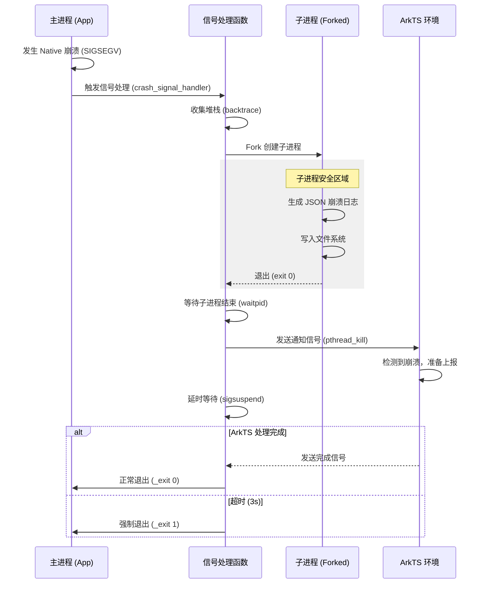

# Native 崩溃捕获方案设计文档

## 1. 概述
本方案实现了一个轻量级的 Android/OpenHarmony Native 崩溃捕获系统。它能够在 C++ 层发生崩溃（如 SIGSEGV）时，捕获信号、收集堆栈、保存日志，并通知上层 ArkTS 环境进行数据上报，最后安全退出应用。

## 2. 核心架构：Hybrid Fork 模型

为了保证在崩溃进程（Crash Process）中进行文件写入和内存分配的安全性，我们采用了 **Fork 子进程** 的处理模型。

### 流程图


## 3. 关键技术点

### 3.1 信号捕获
使用 `sigaction` 注册以下 POSIX 信号：
*   `SIGSEGV` (11): 段错误（空指针、野指针）
*   `SIGABRT` (6):由于 abort() 或 assert 失败
*   `SIGFPE` (8): 浮点异常（除零）
*   `SIGILL` (4): 非法指令
*   `SIGBUS` (7): 总线错误

### 3.2 为什么使用 Fork？
在崩溃的进程中，堆内存（Heap）可能已经被破坏（Heap Corruption）。
*   如果在崩溃进程中直接调用 `malloc`、`printf` 或文件操作，可能会因为锁的状态损坏或内存元数据损坏而导致**二次崩溃**或**死锁**。
*   **Fork 的优势**：子进程会继承父进程的内存镜像，但拥有独立的地址空间。在子进程中进行文件写入操作相对安全，即使子进程崩溃也不会影响父进程的后续处理（如通知 ArkTS）。

### 3.3 为什么不使用 Core Dump？
*   **体积过大**：Core Dump 包含完整内存镜像，通常为几百 MB，不适合移动端上传。
*   **隐私风险**：可能包含用户敏感数据。
*   **本方案**：只采集调用栈（Backtrace）和信号信息，生成 JSON 文件，体积仅几 KB。

### 3.4 与 Google Breakpad 的对比
| 特性 | 本方案 | Google Breakpad |
| :--- | :--- | :--- |
| **机制** | 信号处理 + `backtrace()` | 信号处理 + 读取寄存器/栈内存 |
| **输出** | JSON 文本 (可读) | Minidump 二进制 (需解析) |
| **解析** | 端侧生成符号名 (依赖 `backtrace_symbols`) | 服务端配合符号表解析 |
| **复杂度** | 低 (轻量级) | 高 (工业级) |
| **适用场景** | 中小型应用、快速集成 | 大型商业软件、精确还原现场 |

## 4. 数据格式
生成的崩溃日志存储在 `/data/storage/el2/base/cache/` 下，格式如下：
```json
{
  "signal": 11,
  "signal_name": "SIGSEGV",
  "crash_reason": "Address not mapped to object",
  "backtrace": [
    "libapm.so!crash_signal_handler+0x123",
    "libnative_error_demo.so!CrashNullPointer+0x45",
    "..."
  ]
}
```

## 5. 接口说明
ArkTS 端通过 `NativeCrashService` 初始化：
```typescript
// 初始化，设置缓存路径和超时时间(3s)
testNapi.initNativeCrashHandler(cacheDir, 3);
```
